# Class diagram

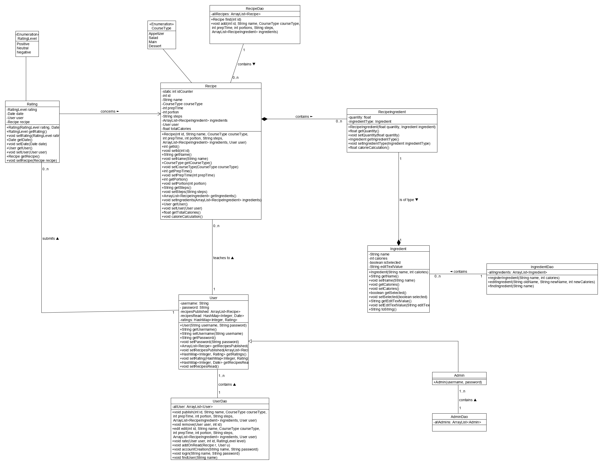

# Sequence diagrams

## Register

## Login

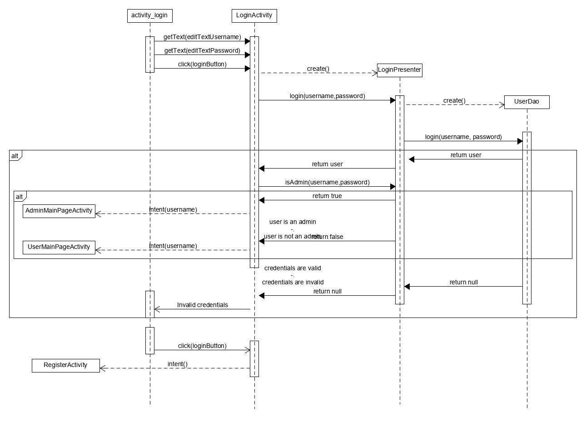

## User main page

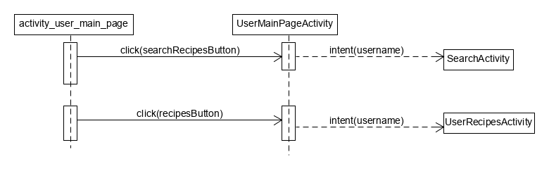

## Admin main page

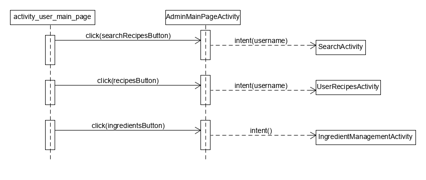

## Search

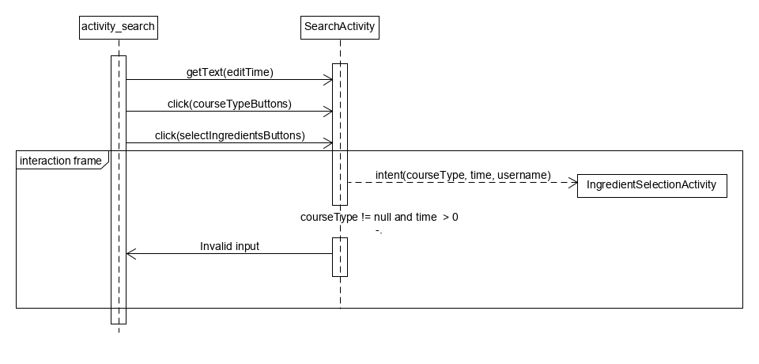

## Ingredient selection

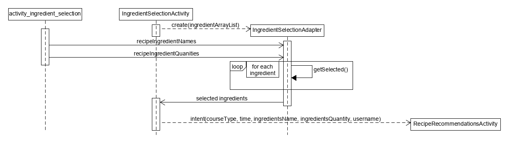

## Recipe recommendations

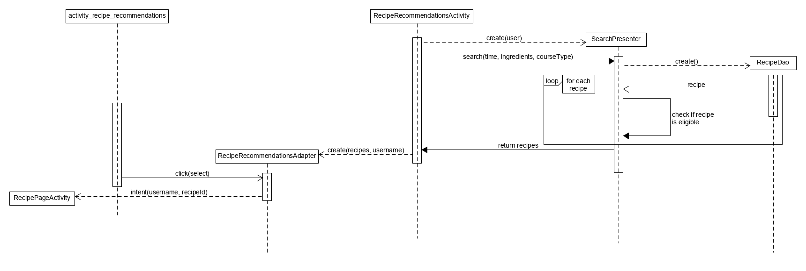

## Recipe page

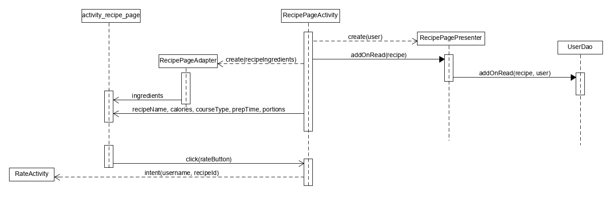

## Rate

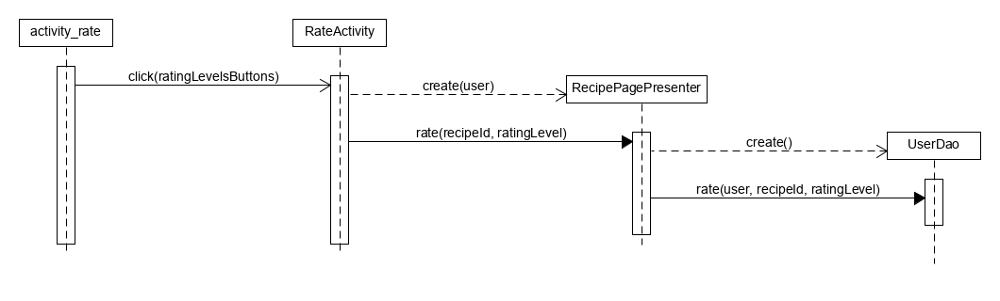

## User recipes

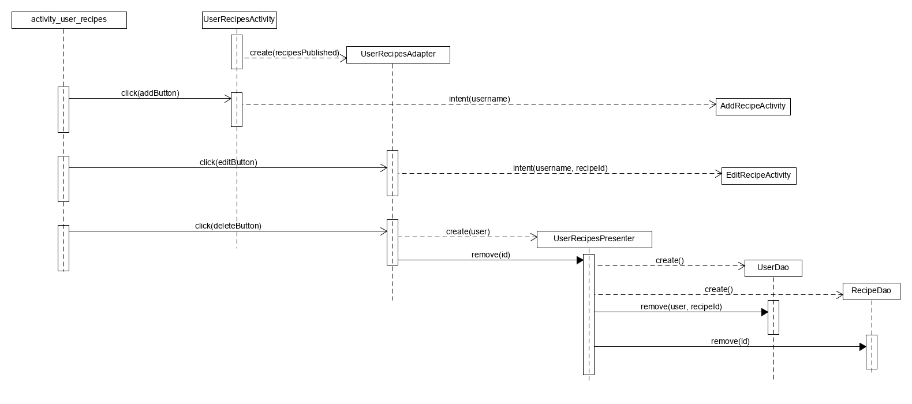

## Add recipe

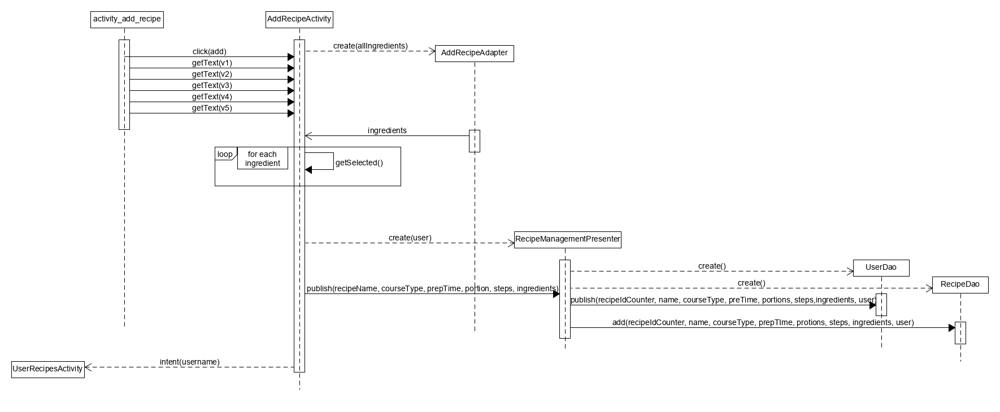

## Edit recipe

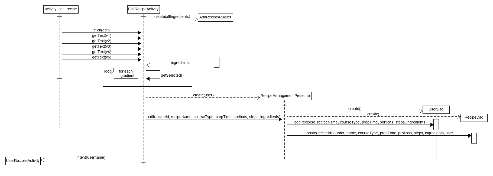

## Ingredient management

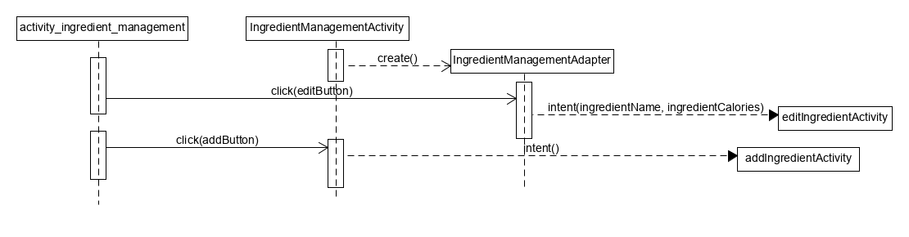

## Add ingredient

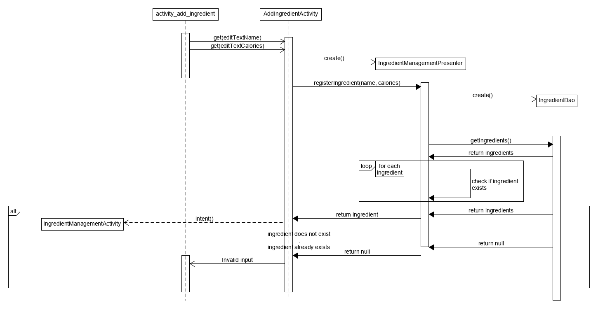

## Edit ingredient

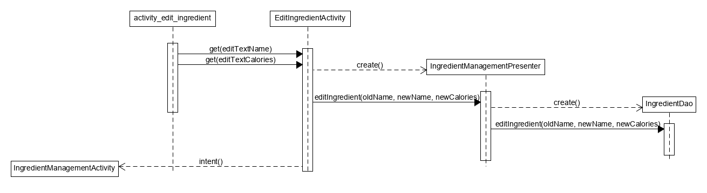