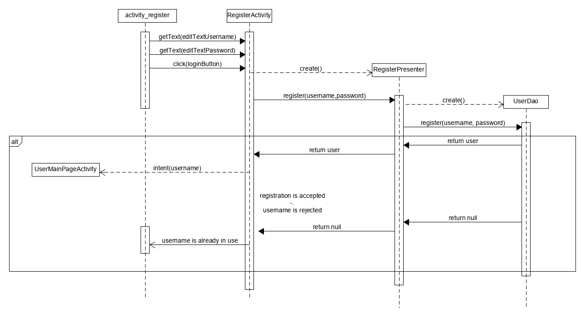

# Class diagram

# Sequence diagrams

## Register

## Login

## User main page

## Admin main page

## Search

## Ingredient selection

## Recipe recommendations

## Recipe page

## Rate

## User recipes

## Add recipe

## Edit recipe

## Ingredient management

## Add ingredient

## Edit ingredient

