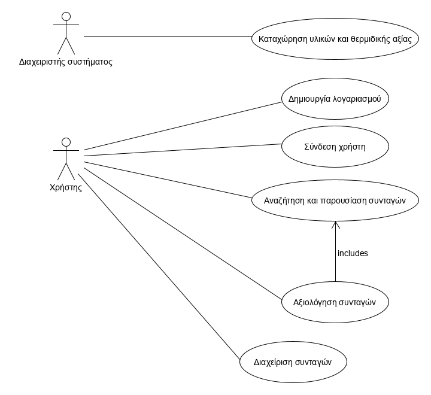

# Overall description

## Use case model overview

# Use cases

#### [UC1 Registration of ingredients and caloric value](uc1_ingredient_and_calorie_count_registration.md)

#### [UC2 Account Creation](uc2_account_creation.md)

#### [UC3 User Sign-in](uc3_user_sign-in.md)

#### [UC4 Search and presentation of recipes](uc4_search.md)

#### [UC5 Recipe Rating](uc5_recipe_rating.md)

#### [UC6 Recipe Management](uc6_recipe_management_activity_diagram.md)

## Additional specifications

- The application will not display recipes that do not meet the material requirements.
- The application shows the user the recipes that take less or equal time than the available time.
- If there are none, it will show the user other recipes, ranked in ascending order based on how long they take. In case of a tie, the user's preferences will be taken into account.
- The recipes will be displayed in order of priority based on the user's preferences.
- Based on this rating, the app will recommend foods similar to what the user likes.
- The app will try to recommend a wide variety of meals to the user based on whether they have recently re-suggested a recipe.
- The service will be available to registered users.
- The system suggests recipes by choosing from the recipes registered by other users.
- The system will calculate the calories of each recipe, based on the quantity and type of ingredients.
- The materials and their calorific value will be registered by the system administrator.
- The application needs an easy-to-use interface. The environment helps the user in his activities while using the application with a visual presentation of its capabilities.
- The grading scale includes three levels: positive, neutral, negative.
- The administrator registers the materials and their calorific value in a table, the editing of which requires administrator privileges.
- Materials not present in this table will not be considered in the search.

# Use case analysis

### Analysis classes

Analysis classes derived from the analysis of the *Account Management* and *Customer Information Management* use cases.

#### Create Account

#### Search and present recipes

#### Recipe management

