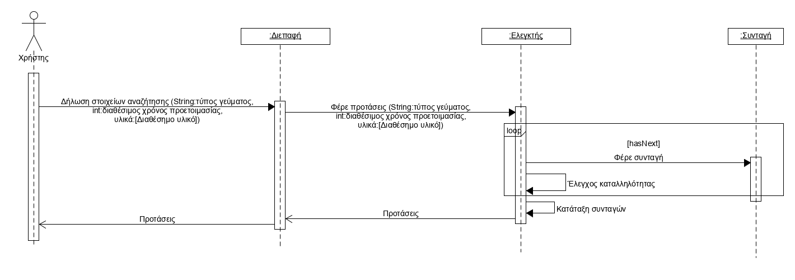

# Εισαγωγή

\[*Μία εισαγωγή που αφορά το παρόν έγγραφο.*\]

## Εμβέλεια

\[*Περιγράφουμε τι θα κάνει και κυρίως τι δεν θα κάνει το λογισμικό. Βλέπε παράδειγμα 3-2 του βιβλίου στη σελίδα 139.*

*Ένα διάγραμμα περιβάλλοντος (πρωταρχικό διάγραμμα ροής δεδομένων) που βοηθά στην κατανόηση του συστήματος σε σχέση με το περιβάλλον του. Βλέπε το σχήμα 4-12 του παραδείγματος 4-1 στη σελίδα 185 του βιβλίου*\]

## Ορισμοί ακρώνυμα και συντομογραφίες

\[*Ένας πίνακας ακρωνύμων και συντομογραφιών που χρησιμοποιούνται στο έγγραφο. Ένας δεύτερος πίνακας με ορισμούς. Οι ορισμοί λαμβάνονται από το γλωσσάρι αν αυτό υπάρχει. Βλέπε πίνακα 3-5 του παραδείγματος 3-1 στη σελίδα 134.*\]

## Αναφορές

\[*Γράφουμε αν υπάρχουμε αναφορές σε άλλα έγγραφα (μελέτη σκοπιμότητας, ΕΠΑΣ, επιχειρησιακά μοντέλα κλπ). Σε περίπτωση που κάποια πληροφορία περιλαμβάνεται σε άλλο έγγραφο γίνεται η αναφορά στο άλλο έγγραφο και δεν επαναλαμβάνεται στο ΕΠΑΛ).*\]

## Επισκόπηση

\[*Γράφουμε πως οργανώνεται το υπόλοιπο έγγραφο*\]

# Συνολική περιγραφή

## Επισκόπηση μοντέλου περιπτώσεων χρήσης

## Υποθέσεις και εξαρτήσεις

\[*Γράφουμε τις υποθέσεις που κάνουμε και τις εξαρτήσεις του συστήματος σε σχέση με το περιβάλλον του.*\]

# Ειδικές Απαιτήσεις 

## Περιπτώσεις χρήσης

### Οι ενδιαφερόμενοι και οι ανάγκες τους

\[*Ένας πίνακας των ενδιαφερομένων (stakeholders) με τις ανάγκες τους. Βλέπε πίνακα 3-6 του παραδείγματος 3-2 στη σελίδα 138 του βιβλίου.*\]

### Actors του συστήματος

\[*Ένα πίνακας με του actors του συστήματος. Βλέπε πίνακας 3-7 παραδείγματος 3-11 στη σελίδα 167 του βιβλίου.*\]

### Περιγραφές περιπτώσεων χρήσης

\[*Γράφονται οι περιπτώσεις χρήσης οι οποίες συνοδεύονται με διαγράμματα δραστηριότητας εάν θεωρηθεί αναγκαίο.*

*Βλέπε , το παράδειγμα 3-7 στη σελίδα 159, το παράδειγμα 3-8 στη σελίδα 160 και το παράδειγμα 3-9 στη σελίδα 162.*\]

#### [ΠΧ1 Καταχώρηση υλικών και θερμιδικής αξίας](uc1_ingredient_and_calorie_count_registration.md)

#### [ΠΧ2 Δημιουργία λογαριασμού](uc2_account_creation.md)

#### [ΠΧ3 Σύνδεση χρήστη](uc3_user_sign-in.md)

#### [ΠΧ4 Αναζήτηση και παρουσίαση συνταγών](uc4_search.md)

#### [ΠΧ5 Αξιολόγηση συνταγών](uc5_recipe_rating.md)

#### [ΠΧ6 Διαχείριση συνταγών](uc6_recipe_management_activity_diagram.md)

## Συμπληρωματικές προδιαγραφές

- Η εφαρμογή δεν θα εμφανίζει συνταγές οι οποίες δεν πληρούν τις προϋποθέσεις υλικών.
- Η εφαρμογή εμφανίζει στον χρήστη τις συνταγές που παίρνουν λιγότερο ή ίσο χρόνο με τον διαθέσιμο.
- Αν δεν υπάρχουν, θα εμφανίζει στον χρήστη άλλες συνταγές, καταταγμένες σε αύξουσα σειρά με βάση τον χρόνο που παίρνουν. Σε περίπτωση ισοβαθμίας, θα λαμβάνονται υπόψη οι προτιμήσεις του χρήστη.
- Οι συνταγές θα εμφανίζονται με σειρά προτεραιότητας με βάση της προτιμήσεις του χρήστη.
- Με βάση αυτή την βαθμολογία, η εφαρμογή θα προτείνει φαγητά παρόμοια με αυτά που αρέσουν στον χρήστη.
- Η εφαρμογή θα προσπαθεί να προτείνει στον χρήστη μεγάλη ποικιλία γευμάτων με βάση το αν έχει προτείνει ξανά πρόσφατα μια συνταγή.
- Η υπηρεσία θα διατίθεται σε εγγεγραμμένους χρήστες.	
- Το σύστημα προτείνει συνταγές επιλέγοντας από τις συνταγές που έχουν καταχωρηθεί από τους υπόλοιπους χρήστες.
- Το σύστημα θα υπολογίζει τις θερμίδες κάθε συνταγής, βάσει της ποσότητας και του είδους των υλικών της.
- Τα υλικά και η θερμιδική τους αξία θα καταχωρούνται από το διαχειριστή του συστήματος.
- Η εφαρμογή χρειάζεται εύχρηστη διεπαφή. Το περιβάλλον βοηθά τον χρήστη στις δραστηριότητες του κατά τη χρήση της εφαρμογής με εύληπτη παρουσίαση των δυνατοτήτων της.
- Η κλίμακα βαθμολόγησης περιλαμβάνει τρία επίπεδα: θετικό, ουδέτερο, αρνητικό. 
- Ο διαχειριστής καταχωρίζει τα υλικά και την θερμιδική τους αξία σε έναν πίνακα, του οποίου η επεξεργασία απαιτεί προνόμια διαχειριστή.
- Υλικά που δεν υπάρχουν στον πίνακα αυτό δεν θα λαμβάνονται υπόψη στην αναζήτηση.

### Περιορισμοί σχεδίασης και υλοποίησης

\[*Βλέπε πίνακα 5-3 του παραδείγματος 5-1 στη σελίδα 305*\]

### Ποιοτικά χαρακτηριστικά

#### Απόδοση

\[*Βλέπε πίνακα 5-4 του παραδείγματος 5-1 στη σελίδα 306*\]

#### Διαθεσιμότητα

\[*Βλέπε πίνακα 5-4 του παραδείγματος 5-1 στη σελίδα 306*\]

#### Ασφάλεια

\[*Βλέπε πίνακα 5-4 του παραδείγματος 5-1 στη σελίδα 306*\]

#### Ευελιξία

\[*Βλέπε πίνακα 5-4 του παραδείγματος 5-1 στη σελίδα 306*\]

#### Ευχρηστία

\[*Βλέπε πίνακα 5-4 του παραδείγματος 5-1 στη σελίδα 306*\]

# Υποστηρικτικό υλικό

## Μοντέλο πεδίου

\[*Εισάγουμε το μοντέλο πεδίου του συστήματος. Βλέπε σχήμα 4-100 του παραδείγματος 4-13 στη σελίδα 251 του βιβλίου*\]

## Ανάλυση περιπτώσεων χρήσης
--------------------------

### Κλάσεις ανάλυσης

Κλάσεις ανάλυσης που έχουν προκύψει από την ανάλυση των περιπτώσεων χρήσης *Διαχείριση Λογαριασμού* και *Διαχείριση Στοιχείων Πελάτη*.

### Συμπεριφορές

\[*Για κάθε σημαντική περίπτωση χρήσης εισάγουμε ένα διάγραμμα κλάσεων με τις κλάσεις που συμμετέχουν στη συμπεριφορά του συστήματος για την περίπτωση χρήσης. Το σημαντικότερο όμως είναι ένα διάγραμμα επικοινωνίας ή ακολουθίας που δείχνει την ανταλλαγή μηνυμάτων.*

*Βλέπε το παράδειγμα 4-16 στη σελίδα 262 του βιβλίου*\]

#### Δημιουργία λογαριασμού

#### Αναζήτηση και παρουσίαση συνταγών

#### Διαχείριση συνταγών

## Άλλα μοντέλα
------------

\[*Άλλα μοντέλα όπως για παράδειγμα διαγράμματα μηχανής καταστάσεων, πίνακες απόφασης κλπ. Βλέπε παράδειγμα 4-6 του βιβλίου*\]

## Επιχειρησιακοί κανόνες

\[*Ένας πίνακας με του επιχειρησιακούς κανόνες. Βλέπε πίνακα 3-4 του παραδείγματος 3-1 στη σελίδας 133 του βιβλίου.*\]

| Επιχειρησιακοί κανόνες | Περιγραφή |
| :----------------------| :---------|
| ΕΚ1 | O Αριθμός Δελτίου Ταυτότητας και το ΑΦΜ είναι μοναδικά για κάθε πελάτη 
| ΕΚ2 | Όλα τα στοιχεία του πελάτη είναι υποχρεωτικά, με εξαίρεση τον αριθμό Fax
| ΕΚ3 | Η ηλικία του πελάτη θα πρέπει να είναι μεγαλύτερη των 18 ετών
