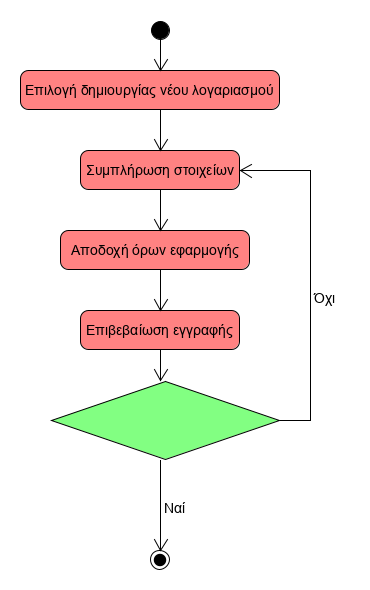

| Περίπτωση χρήσης | Δημιουργία λογαριασμού |
| ------ | ------ |
| Σύντομη περιγραφή	| Ο χρήστης δημιουργεί νέο λογαριασμό στην εφαρμογή.| 
| Χρήστες | Χρήστης | 
| Προϋποθέσεις | Ο χρήστης έχει εγκαταστήσει και ενεργοποιήσει την εφαρμογή. |
| Βασική ροή | Μόλις ο χρήστης ενεργοποιήσει την εφαρμογή επιλεγεί την δημιουργία νέου λογαριασμού. Συμπληρώνει τα στοιχεία που του ζητούνται στα κατάλληλα πεδία. Αποδέχεται τους όρους της εφαρμογής και επιβεβαιώνει την εγγραφή του. | 
| Εναλλακτικές ροές	| Τα στοιχεία του χρήστη απορρίπτονται και εφαρμογή τον ενημερώνει κατάλληλα. Ο χρήστης δεν ολοκληρώνει την δημιουργία νέου λογαριασμού και επιστρέφει στην αρχική σελίδα. |
| Μετασυνθήκες | Ο χρήστης γίνεται μέλος της εφαρμογής. |

### Διάγραμμα δραστηριότητας

