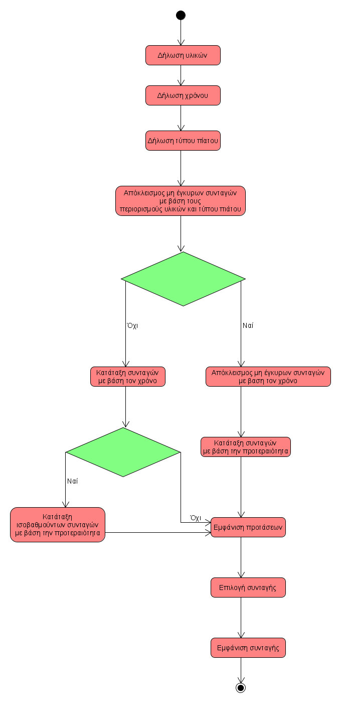

# UC4 Search and presentation of recipes
**Primary Actor**: User
**Interested**
**User** : Wants to find recipes that meet his restrictions.
**Conditions**: The user must be logged into the app with their account.
## Basic Flow
1. The user clicks on the “recipe search” option.
2. The user declares the materials available,
3. The user states the time he has available.
4. The user selects the type of dish from the predefined options.
5. The application excludes recipes that do not meet the material requirements as well as the type of meal.
6. If there are recipes that take less or equal time than the available time, only those are displayed.
7. Recipes are displayed in priority order based on user preferences and when each recipe was last selected.
8. The user selects the recipe he wants.
9. The system redirects the user to the recipe page.
    
**Alternative Streams**

*6a There are no recipes that take less or equal time than the available time*
1. Other recipes are shown to the user, ranked in ascending order based on how long they take.
2. In case of a tie, the user's preferences will be taken into account in the ranking.

### Activity chart

