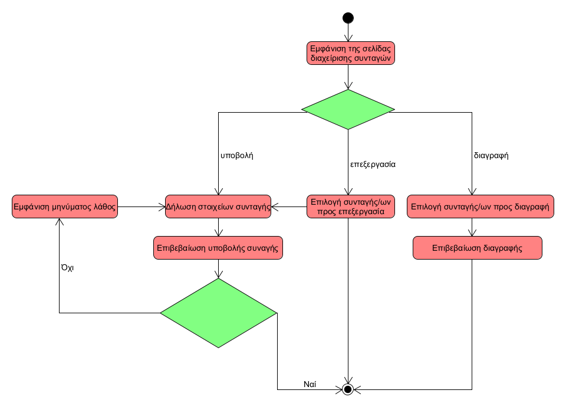

| Περίπτωση χρήσης | Διαχείριση συνταγών|
| ------ | ------ |
| Σύντομη περιγραφή	| Ο χρήστης υποβάλει μια νέα συνταγή στην εφαρμογή.|
| Χρήστες | Χρήστης |
| Προϋποθέσεις | Ο χρήστης πρέπει να έχει συνδεθεί στην εφαρμογή με τον λογαριασμό του.|
| Βασική ροή | Ο χρήστης πηγαίνει στην σελίδα διαχείρισης συνταγών οπού υπάρχει ο πίνακας όπου μπορεί να δει τις συνταγές που έχει ήδη υποβάλει. Έπειτα δηλώνει την επιθυμία του να υποβάλει μια συνταγή. Αρχικά δηλώνει το όνομα, τα υλικα τα οποία περιλαμβάνει η συνταγή, τον χρόνο ολοκλήρωσης της, τις μερίδες οι οποίες προκύπτουν από αυτές τις αναλογίες υλικών, το είδος γεύματος και τέλος τα βήματα εκτέλεσης της συνταγής. Μετά επιβεβαιώνει την υποβολή της συνταγής. Για την διαγραφή δηλώνει την επιθυμία του να διαγράψει μια συνταγή και τέλος επιβεβαιώνει την επιλογή του. Αν ο χρήστης θέλει να επεξεργαστεί μια συνταγή τότε κάνει την κατάλληλη επιλογή η οποία θα τον οδηγεί στην σελίδα συμπλήρωσης στοιχείων που χρησιμοποιείται και για την υποβολή νέας συνταγής.|
| Εναλλακτικές ροές	| Ο χρήστης δεν ολοκληρώνει την δήλωση ή επεξεργασία της συνταγής. Ο χρήστης δεν συμπληρώνει κάποιο πεδίο και η εφαρμογή τον ενημερώνει κατάλληλα.|
| Μετασυνθήκες | Η νέα συνταγή αποθηκεύεται στην βάση δεδομένων και μπορεί να εμφανιστεί στους χρήστες μέσω της αναζήτησης συνταγών.|

### Διάγραμμα δραστηριότητας

